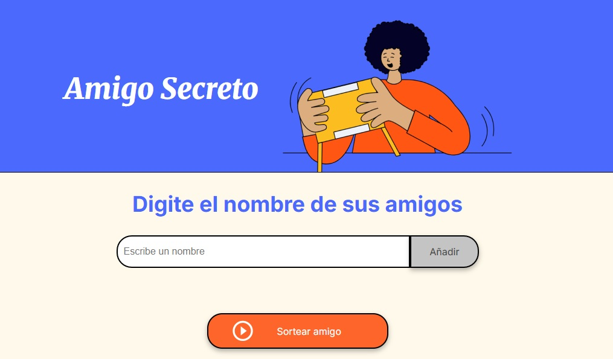
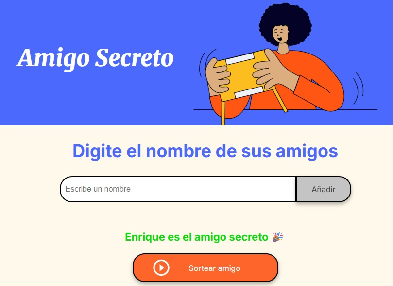

# Challenge_Amigo_secreto

# Amigo Secreto

Aplicación web para organizar un sorteo de "Amigo Secreto" de forma sencilla y rápida.

## Funcionalidades

- **Agregar nombres:** Los usuarios pueden escribir el nombre de un amigo y añadirlo a una lista visible.
- **Validación de entrada:** Si el campo de texto está vacío, se muestra una alerta solicitando un nombre válido.
- **Visualización de la lista:** Los nombres ingresados aparecen en una lista debajo del campo de entrada.
- **Sorteo aleatorio:** Al hacer clic en el botón "Sortear amigo", se selecciona aleatoriamente un nombre de la lista y se muestra el resultado en pantalla.
- **Reinicio automático:** Tras el sorteo, la lista se vacía para permitir iniciar un nuevo juego.

## Capturas de pantalla

### 1. Pantalla principal con campo para agregar nombres
*Aquí debe verse el campo de texto, el botón "Añadir" y la lista vacía.*

---

### 2. Lista de amigos agregados
*Aquí debe verse la lista con varios nombres añadidos por el usuario.*

---

### 3. Resultado del sorteo
*Aquí debe verse el nombre sorteado como "amigo secreto" y la lista vacía para un nuevo juego.*

---

## Cómo ejecutar

1. Clona el repositorio.
2. Abre el archivo `index.html` en tu navegador.

---

## Autor

Desarrollado por José Enrique Maldonado Verazas.