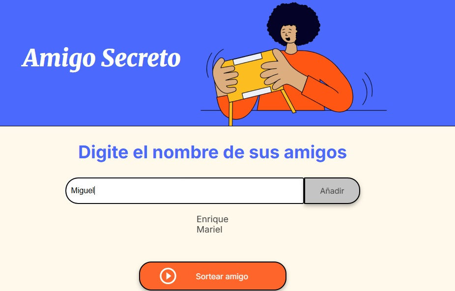

# Challenge_Amigo_secreto

# Amigo Secreto

Aplicación web para organizar un sorteo de "Amigo Secreto" de forma sencilla y rápida.

## Funcionalidades

- **Agregar nombres:** Los usuarios pueden escribir el nombre de un amigo y añadirlo a una lista visible.
- **Validación de entrada:** Si el campo de texto está vacío, se muestra una alerta solicitando un nombre válido.
- **Visualización de la lista:** Los nombres ingresados aparecen en una lista debajo del campo de entrada.
- **Sorteo aleatorio:** Al hacer clic en el botón "Sortear amigo", se selecciona aleatoriamente un nombre de la lista y se muestra el resultado en pantalla.
- **Reinicio automático:** Tras el sorteo, la lista se vacía para permitir iniciar un nuevo juego.

## Capturas de pantalla

### 1. Pantalla principal con campo para agregar nombres
*En esta imagen se muestra la pantalla inicial de la aplicación, donde el usuario puede ingresar el nombre de sus amigos en el campo de texto y añadirlos a la lista. La lista aparece vacía antes de agregar cualquier nombre.*

---

### 2. Lista de amigos agregados
*Aquí se observa la lista con varios nombres que el usuario ha añadido. Cada nombre aparece como un elemento de la lista, permitiendo visualizar fácilmente todos los participantes antes de realizar el sorteo.*

---

### 3. Resultado del sorteo
*En esta imagen se muestra el resultado después de realizar el sorteo. El nombre seleccionado como "amigo secreto" aparece destacado y la lista de participantes se vacía automáticamente para iniciar un nuevo juego.*

---

## Cómo ejecutar

1. Clona el repositorio.
2. Abre el archivo `index.html` en tu navegador.

---

## Autor

Desarrollado por José Enrique Maldonado Verazas.